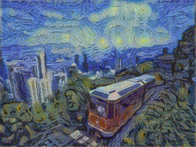

# Implementing of a Neural Algorithm of Artistic Style #

This is an implementation of the "[A Neural Algorithm of Artistic Style](http://arxiv.org/abs/1508.06576)". This uses the selected filtered responses of a pre-trained model (VGG-19) to capture low level to high level features and transfer them to the content image.

This code is documented so you can follow along while reading with the paper. You can also just replace with your own images and to generate your new painting.

Results:

Using the StarryNight:

# How to run

You will need to install dependencies:

- TensorFlow
- Scipy
- Numpy

You will need to download the [VGG-16 model: vgg16_weights.npz](https://www.cs.toronto.edu/~frossard/vgg16/vgg16_weights.npz).

Then just run art_vgg16.py.

# more words
This project is forked from [log0/neural-style-painting](https://github.com/log0/neural-style-painting), thanks for this brilliant work! there are two main modifications:
1. model is changed from imagenet-vgg-verydeep-19.mat to vgg16_weights.npz ;
2. resizing content and style images when loading.

References:
- [A Neural Algorithm of Artistic Style](http://arxiv.org/abs/1508.06576)
- [https://github.com/jcjohnson/neural-style](https://github.com/jcjohnson/neural-style)
- [https://github.com/ckmarkoh/neuralart_tensorflow](https://github.com/ckmarkoh/neuralart_tensorflow)
